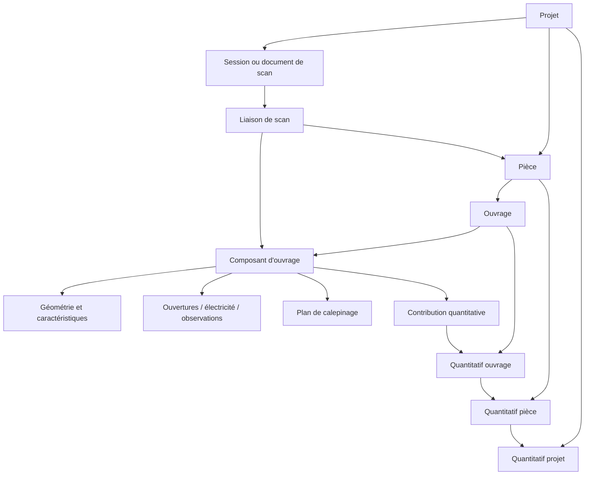

# Plaquisto — architecture des données : projets, scans, ouvrages, composants, calepinages et quantitatifs

> Document de cadrage et de passation destiné à Codex.
>
> Statut : **spécification d’architecture à auditer avant implémentation**.
>
> Vocabulaire métier validé le 18 septembre 2026.

## Décisions ultérieures prioritaires — 18 septembre 2026

Ces décisions remplacent les prescriptions contradictoires plus bas dans le document :

- L'utilisateur autorise la suppression des anciennes sauvegardes de test et un démarrage vierge pour la nouvelle architecture. La reprise des anciens `projects.json`, scans de test et calepinages n'est plus requise. Ne pas développer de migration des noms historiques, de redistribution de surfaces anciennes ni de double lecture durable des anciens modèles pour préserver ces tests.
- Cette remise à zéro concerne les données applicatives de test ; elle ne concerne ni le code, ni les référentiels métier, ni les documents/photos originaux de l'utilisateur. Identifier précisément les emplacements avant suppression. Une remise à zéro lors du premier lancement d'une nouvelle version doit être exécutée une seule fois, jamais à chaque lancement.
- Conserver un schéma versionné et les validations de références pour les nouvelles données. Les migrations futures restent nécessaires dès que les vrais projets seront conservés.
- Un ouvrage de doublage représente le doublage total. Chacun de ses murs est un composant d'ouvrage avec ses propres dimensions et son plan de calepinage.
- Pour une cloison partagée, **tout le quantitatif, y compris les deux côtés, est imputé à la pièce propriétaire** (la plus petite par défaut). L'autre pièce affiche uniquement un lien vers la même cloison ; aucune contribution n'est ajoutée à son total.

Les sections historiques consacrées à la migration des anciennes sauvegardes restent un contexte d'audit, pas une obligation d'implémentation.

## 1. Mission confiée à Codex

Codex doit étudier l’existant, vérifier que les termes et les nouveaux objets décrits ici ne contredisent pas les modèles déjà présents, puis proposer et mettre en œuvre une migration progressive de l’application.

L’objectif n’est pas seulement de ranger les données. L’utilisateur doit pouvoir passer sans rupture :

1. du scan LiDAR ou du plan 3D d’une pièce ;
2. à un composant précis d’un ouvrage, par exemple `Mur B` ;
3. au plan de calepinage de ce composant ;
4. au quantitatif de l’ouvrage complet ;
5. au quantitatif agrégé d’une pièce ;
6. puis au quantitatif global du projet.

Le chemin inverse doit également fonctionner. Depuis une ligne de quantitatif, l’utilisateur doit pouvoir retrouver l’ouvrage, ses composants, leurs plans de calepinage et, lorsque cela existe, la géométrie correspondante dans le scan 3D.

La priorité est de créer **un graphe de données cohérent et navigable**, pas plusieurs copies indépendantes d’un même mur ou d’une même ouverture.

## 2. Décisions métier déjà validées

Les décisions suivantes sont normatives. Elles ne doivent pas être renommées ou modifiées sans validation explicite.

### 2.1 Vocabulaire affiché dans l’application

| Terme retenu | Définition |
|---|---|
| **Projet** | Dossier principal : client, adresse, notes, pièces, scans, ouvrages et quantitatifs. Il remplace partout le terme affiché **Chantier**. |
| **Pièce** | Espace physique du projet : salon, bureau, chambre, etc. |
| **Ouvrage** | Ensemble métier complet configuré et quantifiable : doublage périphérique, cloison de distribution, plafond, etc. |
| **Composant d’ouvrage** | Partie physique identifiable d’un ouvrage : `Mur A`, `Mur B`, `Plafond principal`, `Rampant 1`, etc. |
| **Plan de calepinage** | Implantation 2D des plaques, ossatures, ouvertures et éléments électriques d’un composant d’ouvrage. Ce terme remplace **plan d’exécution**. |
| **Quantitatif** | Résultat calculé à un périmètre donné : composant, ouvrage, pièce ou projet. |

Le mot **calepinage** doit être orthographié ainsi dans l’interface, le code métier et la documentation. Ne pas introduire la variante « calpinage » dans de nouvelles données.

### 2.2 Exemple de hiérarchie

```text
Projet : Rénovation Dupont
└── Pièce : Salon
    ├── Ouvrage : Doublage périphérique
    │   ├── Composant d’ouvrage : Mur A
    │   │   └── Plan de calepinage
    │   ├── Composant d’ouvrage : Mur B
    │   │   └── Plan de calepinage
    │   ├── Composant d’ouvrage : Mur C
    │   └── Composant d’ouvrage : Mur D
    └── Ouvrage : Plafond sur fourrures
        ├── Composant d’ouvrage : Plafond principal
        │   └── Plan de calepinage
        ├── Composant d’ouvrage : Rampant 1
        └── Composant d’ouvrage : Rampant 2
```

Un composant d’ouvrage n’est pas un simple écran et n’est pas une copie du plan de calepinage. Il représente la partie physique réelle de l’ouvrage. Il peut exister sans calepinage.

### 2.3 Cloison entre deux pièces

Une cloison ne doit jamais être dupliquée pour apparaître dans deux pièces.

Règle retenue :

- la cloison appartient par défaut à la plus petite des deux pièces qu’elle sépare ;
- cette affectation est calculée une fois lors de la création, puis enregistrée ;
- elle ne doit pas changer automatiquement si une surface de pièce est corrigée plus tard ;
- l’utilisateur peut corriger manuellement la pièce propriétaire ;
- en cas d’égalité ou d’incertitude, l’application demande de choisir ;
- l’autre pièce conserve un lien vers la même cloison, sans en créer une copie ;
- l’ossature commune est comptée une seule fois ;
- les traitements et calepinages de chaque côté peuvent être différents.

Dans l’interface, éviter les termes génériques rejetés « pan » et « face » pour nommer `Mur A`, `Mur B`, etc. Le terme générique est **composant d’ouvrage**. Pour distinguer les deux côtés d’une cloison, utiliser un libellé concret lié aux pièces, par exemple `Côté Bureau` et `Côté Salon`. Le nom technique Swift de cette notion doit être choisi après l’audit des symboles existants.

## 3. État actuel du dépôt à prendre en compte

Cette section décrit l’existant observé au moment de la rédaction. Codex doit le revérifier avant toute modification.

### 3.1 Projets et ouvrages

Dans `Plaquisto/PlaquistoCore/Models/WorkModels.swift` :

- `ProjectItem` contient directement `[WorkItem]` ;
- il n’existe pas encore d’entité `Pièce` persistée ;
- `WorkItem` représente l’ouvrage et contient son `WorkConfiguration` ;
- `WorkItem` ne contient qu’un seul `layoutDocument` optionnel ;
- la pièce est actuellement déduite du nom `Pièce - Ouvrage` par `inferredRoomName` ;
- les quantités sont enregistrées dans plusieurs structures spécifiques (`DoublageQuantity`, `CloisonQuantity`, etc.).

Dans `Plaquisto/Plaquisto/ProjectStore.swift` :

- les projets sont enregistrés dans `projects.json` ;
- un calepinage exporté crée aujourd’hui un ouvrage et copie le `LayoutDocument` dans cet ouvrage ;
- les liens entre ouvertures et ouvrages utilisent notamment `sourceWorkID` ;
- plusieurs règles métier s’appuient sur le nom de pièce déduit du nom d’ouvrage.

Conséquence : il ne faut pas supprimer brutalement le nom, `inferredRoomName`, `layoutDocument` ou `sourceWorkID`. Ils doivent servir de données de compatibilité pendant la migration.

### 3.2 Scan 3D

Dans `Plaquisto/Plaquisto/PlaquistoRoomModel.swift` :

- `PlaquistoRoomModel` contient murs, ouvertures, plafonds, sols et rampants ;
- les géométries ont des identifiants et une provenance portable (`roomPlan`, `arCore`, `lidar`, `manual`, `imported`) ;
- les corrections manuelles sont distinguées des mesures brutes ;
- `PlaquistoRoomDocument` conserve un état initial et un état de travail ;
- `PlaquistoRoomStore` enregistre actuellement un fichier de scan séparé du `ProjectStore`.

`RoomPlanAdapter.swift` dépend d’Apple RoomPlan, mais le modèle de domaine n’embarque pas les types du SDK. Cette séparation est bonne et doit être conservée.

Conséquence : le scan et les projets sont actuellement deux silos. Il faut les relier par identifiants stables, sans transformer les objets RoomPlan en objets métier persistés.

### 3.3 Calepinage 2D

Dans `Plaquisto/PlaquistoCore/Tools/SheetLayoutEngine.swift` :

- `Surface2D` contient le contour, les ouvertures, la provenance et le repère local ;
- `LayoutDocument` contient la surface, les couches de plaques, les ossatures et l’électricité ;
- `Surface2DAdapter` permet déjà de projeter une géométrie 3D dans son vrai plan local ;
- les calepinages autonomes et les calepinages rattachés à un ouvrage n’ont pas encore une source de vérité commune.

Risque : le contour et les ouvertures peuvent finir par être enregistrés à la fois dans le scan, dans le composant d’ouvrage et dans `Surface2D`. Codex doit définir clairement quel objet est maître et comment les dérivés sont invalidés.

### 3.4 Quantitatifs

Dans `CombinedQuantityView.swift`, l’agrégation actuelle :

- parcourt une liste de `WorkItem` ;
- convertit les configurations selon leur type ;
- additionne les lignes par nom canonisé et unité.

Cette base fonctionne mais ne permet pas encore :

- un agrégat natif par pièce, puisqu’il n’existe pas d’entité `Pièce` ;
- une traçabilité complète d’une ligne vers son composant et sa règle de calcul ;
- une protection robuste contre le double comptage des cloisons partagées ;
- une distinction explicite entre estimation métier et quantité exacte issue d’un calepinage.

### 3.5 Libellé « Chantier »

Le code technique utilise déjà `ProjectItem`, `ProjectStore` et `projectID`, mais plusieurs écrans affichent encore `Chantier`, notamment `PlaquistoApp.swift` et `ProjectsView.swift`.

La cible est :

- code technique : conserver `Project...` lorsqu’il est déjà correct ;
- interface française : afficher **Projet**, **Mes projets**, **Nouveau projet**, etc. ;
- migration des données : aucune modification d’identifiant ou de fichier n’est requise uniquement pour ce changement de libellé ;
- documentation et messages d’erreur : remplacer « chantier » quand il désigne le dossier Plaquisto ;
- textes pédagogiques parlant réellement du travail « sur chantier » : les conserver. Exemple : « contrôle sur chantier » ne désigne pas l’objet `Projet`.

## 4. Risques de conflit de vocabulaire à auditer

Avant de créer des types Swift, lancer une recherche globale dans l’application, les tests et la documentation.

| Terme métier | Risque actuel | Règle |
|---|---|---|
| Projet | `ProjectItem` existe déjà | Étendre/migrer l’existant, ne pas créer un deuxième concept concurrent. |
| Pièce | `PlaquistoRoomModel` représente une pièce scannée, mais pas encore la pièce métier du projet | Distinguer la pièce métier persistée de son ou ses documents de scan. |
| Ouvrage | `WorkItem` est déjà l’ouvrage | Conserver une seule identité stable d’ouvrage. |
| Composant d’ouvrage | Le mot `Component` est déjà utilisé localement dans plusieurs vues/configurateurs | Choisir un nom technique non ambigu, par exemple `WorkComponentRecord`, après audit. Le libellé utilisateur reste « Composant d’ouvrage ». |
| Plan de calepinage | `LayoutDocument` existe | L’envelopper ou le référencer ; ne pas recréer un second moteur de calepinage. |
| Ouverture | Existe dans le scan, `Surface2D`, `OpeningConfiguration` et comme `WorkType.openings` | Définir une ouverture métier canonique et des adaptations, pas quatre copies non synchronisées. |
| Surface | Peut désigner une aire, une surface RoomPlan ou le support 2D | Préférer des noms techniques précis : `areaM2`, `ScanSurface`, `ComponentGeometry`, etc. |
| Côté de cloison | Les configurations actuelles utilisent `faceA...` et `faceB...` | Ces clés de compatibilité peuvent rester internes ; ne pas afficher « face » pour nommer les composants. |

Commandes d’audit recommandées :

```bash
rg -n "Chantier|chantier|ProjectItem|WorkItem|Room|roomName|Component|layoutDocument|sourceWorkID|Opening|Surface2D" Plaquisto --glob '*.swift'
rg -n "Chantier|chantier|composant|pan|face|plan d.exécution|calpinage" docs PROJECT_STATE.md
```

Codex doit produire une courte table « terme existant → terme cible → action » avant de modifier les modèles persistés.

## 5. Graphe métier cible



Les flèches décrivent des relations par identifiants. Elles ne signifient pas qu’il faut imbriquer et dupliquer toutes les structures dans chaque parent.

## 6. Modèle de données recommandé

Les noms Swift ci-dessous sont des propositions techniques, pas des libellés utilisateur. Ils doivent être validés par l’audit de conflits.

### 6.1 Document racine du projet

Un projet doit être sauvegardé comme un agrégat cohérent, versionné et migrable.

```swift
struct ProjectDocument: Codable, Identifiable {
    var schemaVersion: Int
    var project: ProjectRecord
    var rooms: [RoomRecord]
    var works: [WorkItem]
    var components: [WorkComponentRecord]
    var layoutPlans: [LayoutPlanRecord]
    var scanDocuments: [ScanDocumentRecord]
    var features: [ComponentFeatureRecord]
    var media: [MediaAssetRecord]
    var observations: [ObservationRecord]
    var quantitySnapshots: [QuantitySnapshot]
}
```

Cette forme normalisée facilite les liens, les recherches et les migrations. Si le dépôt impose de conserver temporairement `works` imbriqué dans `ProjectItem`, introduire d’abord des champs optionnels et des index calculés. Ne pas créer deux sources de vérité durables.

### 6.2 Projet

Champs minimaux :

- `id` stable ;
- nom du projet ;
- client ;
- adresse ;
- notes ;
- dates de création et modification ;
- version du schéma ;
- éventuellement statut et archivage plus tard.

Le remplacement visuel « Chantier » → « Projet » ne doit pas changer l’UUID d’un projet existant.

### 6.3 Pièce

```swift
struct RoomRecord: Codable, Identifiable {
    let id: UUID
    let projectID: UUID
    var name: String
    var floorAreaM2: Double?
    var volumeM3: Double?
    var scanDocumentIDs: [UUID]
    var createdAt: Date
    var updatedAt: Date
}
```

Principes :

- une pièce existe indépendamment d’un scan ;
- une pièce peut être créée manuellement ;
- une pièce peut avoir plusieurs captures ou versions de scan ;
- un scan ne doit pas devenir l’identité de la pièce ;
- les ouvrages référencent `roomID`, jamais seulement un nom de pièce ;
- le nom reste modifiable sans casser les liens.

### 6.4 Ouvrage

`WorkItem` reste le concept central de l’ouvrage. Il doit progressivement recevoir :

- un `roomID` propriétaire explicite ;
- éventuellement des `linkedRoomIDs` pour les ouvrages visibles depuis d’autres pièces ;
- sa configuration métier actuelle ;
- la liste ou l’index de ses composants ;
- son état de calcul et ses révisions ;
- sa règle de propriété lorsqu’il s’agit d’une cloison partagée.

Un ouvrage porte la configuration commune : système, type d’ossature, isolant, parements, entraxes, règles et paramètres de calcul. Ces données ne doivent pas être recopiées dans chaque composant si elles sont identiques.

### 6.5 Composant d’ouvrage

```swift
struct WorkComponentRecord: Codable, Identifiable {
    let id: UUID
    let projectID: UUID
    let workID: UUID
    var displayName: String       // Mur A, Mur B, Plafond principal, Rampant 1…
    var kind: WorkComponentKind   // wall, ceiling, slope, partitionSegment…
    var order: Int
    var geometry: ComponentGeometry
    var geometryRevision: Int
    var featureIDs: [UUID]
    var scanBindingIDs: [UUID]
    var createdAt: Date
    var updatedAt: Date
}
```

Le composant est la source de vérité pour :

- son contour physique ;
- ses dimensions effectives ;
- sa surface brute et sa surface nette calculable ;
- ses angles ;
- son repère local 2D/3D ;
- ses ouvertures, trémies et éléments électriques via des objets liés ;
- les corrections manuelles apportées à la géométrie ;
- le lien vers la ou les surfaces dont il provient dans le scan.

Il ne doit pas contenir en propre les positions calculées de toutes les plaques si celles-ci appartiennent au plan de calepinage.

### 6.6 Plan de calepinage

```swift
struct LayoutPlanRecord: Codable, Identifiable {
    let id: UUID
    let projectID: UUID
    let workID: UUID
    let componentID: UUID
    var treatmentContextID: UUID? // utile pour les deux côtés d’une cloison
    var document: LayoutDocument
    var sourceGeometryRevision: Int
    var revision: Int
    var status: LayoutPlanStatus
    var createdAt: Date
    var updatedAt: Date
}
```

Le plan de calepinage est la source de vérité pour :

- le format et le sens des plaques ;
- leur position, leurs découpes et leur optimisation ;
- la position calculée ou corrigée des ossatures ;
- les options d’affichage et de travail propres au calepinage ;
- les calculs exacts issus du dessin.

Il référence le composant et sa révision géométrique. Le contour utilisé par `LayoutDocument.surface` peut rester présent comme instantané nécessaire au moteur, mais il doit être considéré comme une **projection/version dérivée** de la géométrie du composant, pas comme une seconde vérité silencieuse.

Un composant peut avoir :

- aucun plan de calepinage ;
- un plan courant ;
- plusieurs révisions historiques ;
- pour une cloison, un plan courant par contexte de traitement (`Côté Bureau`, `Côté Salon`).

### 6.7 Caractéristiques liées au composant

Prévoir une représentation extensible, par exemple :

```swift
enum ComponentFeaturePayload: Codable {
    case opening(DomainOpening)
    case electricalPoint(ElectricalPoint)
    case hatch(HatchFeature)
    case annotation(GeometricAnnotation)
}
```

Chaque caractéristique doit posséder :

- un identifiant stable ;
- un `componentID` ;
- une position dans le repère local du composant ;
- sa provenance (`scan`, `manual`, `imported`) ;
- une révision ;
- un niveau de validation humaine si la détection est incertaine.

#### Cas particulier des ouvertures

Une fenêtre détectée par le scan, visible dans le calepinage et utilisée dans le quantitatif doit rester **la même ouverture métier**.

Les représentations actuelles (`PlaquistoOpening`, `LayoutOpening`, `OpeningInput`) deviennent des adaptations de contexte :

- `PlaquistoOpening` : observation issue du scan ;
- ouverture métier liée au composant : source canonique validée ;
- `LayoutOpening` : projection 2D consommée par le moteur de calepinage ;
- `OpeningInput` : paramètres métier supplémentaires nécessaires au calcul.

Ne pas recopier largeur, hauteur et position dans plusieurs objets sans identifiant commun et règle de synchronisation.

`WorkType.openings` existe déjà et calcule des fournitures. Pendant la migration, il peut rester un module/ouvrage auxiliaire compatible, mais il doit référencer les identifiants des ouvertures canoniques. Codex doit auditer ce point et proposer explicitement si, à terme, ces calculs deviennent une contribution du même ouvrage ou restent un ouvrage séparé. Ne pas trancher implicitement pendant une migration technique.

### 6.8 Scans et liaisons

Le modèle de scan doit rester portable et séparé des adaptateurs Apple/Android.

```swift
struct ScanBinding: Codable, Identifiable {
    let id: UUID
    let scanDocumentID: UUID
    let sourceObjectID: UUID
    let target: EntityReference // room ou component
    var bindingKind: BindingKind
    var confidence: Double?
    var manuallyConfirmed: Bool
}
```

Le `sourceIdentifier` d’un SDK sert uniquement à corréler une acquisition. Il ne remplace jamais l’UUID métier du composant.

Relation attendue :

```text
Surface RoomPlan/ARCore/LiDAR
        ↓ adaptateur
PlaquistoRoomDocument portable
        ↓ association validée
ScanBinding
        ↓
Composant d’ouvrage
        ↓ projection locale
Surface2D du plan de calepinage
```

### 6.9 Photos, audio et observations

Les médias doivent pouvoir être rattachés au projet, à une pièce, à un ouvrage ou à un composant.

```swift
enum EntityReference: Codable, Hashable {
    case project(UUID)
    case room(UUID)
    case work(UUID)
    case component(UUID)
    case layoutPlan(UUID)
}
```

`MediaAssetRecord` stocke les métadonnées, pas nécessairement le binaire dans le JSON :

- identifiant ;
- cible `EntityReference` ;
- type MIME ;
- chemin relatif sécurisé ou identifiant de stockage ;
- empreinte/hash ;
- date ;
- durée pour un audio ;
- métadonnées de pose/caméra portables si disponibles ;
- miniature ;
- provenance.

Une note vocale peut produire une transcription et des observations structurées. Le texte extrait est une donnée dérivée : il doit conserver un lien vers l’audio source et demander confirmation avant de créer ou modifier définitivement un ouvrage ou un composant.

Pendant un scan, l’application peut conserver une `CaptureSession` avec :

- la pièce active ;
- le composant visé ou sélectionné ;
- l’horodatage ;
- la pose de la caméra ;
- les photos et segments audio pris à cet instant.

Cette information facilite le rattachement automatique, mais l’utilisateur doit pouvoir corriger la cible.

## 7. Source de vérité par catégorie de données

| Donnée | Source de vérité | Dérivés autorisés |
|---|---|---|
| Nom et identité du projet | `ProjectRecord` | Titres et recherches |
| Nom et identité de la pièce | `RoomRecord` | Nom d’ouvrage généré, fil d’Ariane |
| Configuration technique | `WorkItem.payload` | Résumés, calculs, formulaires |
| Contour/dimensions validés | `WorkComponentRecord.geometry` | Projection 2D, scène 3D, surface calculée |
| Observation brute du scan | `PlaquistoRoomDocument`/scan record | Proposition de géométrie métier |
| Ouverture validée | caractéristique métier du composant | `LayoutOpening`, entrée de calcul, rendu 3D |
| Position des plaques et ossatures calculées | `LayoutPlanRecord.document` | Aperçus, métrés exacts |
| Résultat métier courant | calculateur à partir des données sources | vue agrégée et contribution quantitative |
| Devis/export historique | `QuantitySnapshot` versionné | PDF, partage, comparaison |

Règle fondamentale : modifier un dérivé ne doit pas écraser silencieusement sa source. Toute promotion d’une correction du calepinage vers la géométrie du composant doit être explicite.

## 8. Quantitatifs multi-niveaux

### 8.1 Niveaux attendus

Le même moteur d’agrégation doit accepter un périmètre :

```swift
enum QuantityScope: Hashable {
    case component(UUID)
    case work(UUID)
    case room(UUID)
    case project(UUID)
    case selection(Set<EntityReference>)
}
```

- **Composant** : quantités imputables à `Mur B` ou `Rampant 1` ;
- **Ouvrage** : somme de ses composants et de ses fournitures communes ;
- **Pièce** : somme des ouvrages dont elle est propriétaire, selon les règles de partage ;
- **Projet** : somme de toutes les contributions uniques ;
- **Sélection** : outil actuel de sélection de plusieurs ouvrages, conservé comme périmètre libre.

### 8.2 Contribution traçable

Créer à terme une forme normalisée, sans supprimer immédiatement les structures de quantité existantes :

```swift
struct QuantityContribution: Codable, Identifiable {
    let id: UUID
    let source: EntityReference
    let workID: UUID
    let roomID: UUID
    let catalogueItemID: String?
    let canonicalName: String
    let quantity: Double
    let unit: QuantityUnit
    let calculationRuleID: String?
    let sourceRevision: Int
}
```

Chaque ligne agrégée doit pouvoir afficher « Voir l’origine » et remonter vers les contributions qui la composent.

Quand un identifiant catalogue existe, agréger par identifiant catalogue et unité. Le nom affiché ne doit pas être la seule clé durable. Le regroupement actuel par nom canonisé peut rester un mode de compatibilité pour les anciennes données.

### 8.3 Estimation métier et résultat exact du calepinage

Ne pas mélanger silencieusement :

- le quantitatif estimatif du formulaire métier ;
- le nombre exact de plaques/découpes ou les mètres d’ossatures du plan de calepinage.

Chaque contribution doit indiquer son origine, par exemple :

- `businessEstimate` ;
- `layoutExact` ;
- `manualOverride`.

Une politique explicite choisit la valeur retenue. Par défaut, l’interface peut montrer le quantitatif métier et proposer le résultat exact du calepinage lorsqu’il est complet et à jour. Aucun remplacement automatique ne doit modifier un devis sauvegardé.

### 8.4 Cloisons partagées

Pour éviter les doubles comptes :

- l’ossature, l’isolant commun et les éléments traversants appartiennent à une contribution commune de l’ouvrage ;
- les plaques, finitions et calepinages propres à chaque côté appartiennent au contexte `Côté <Pièce>` ;
- l’ouvrage n’est agrégé qu’une fois dans le quantitatif du projet ;
- dans le quantitatif d’une pièce liée mais non propriétaire, l’interface peut afficher les contributions de son côté, sans recopier la contribution commune ;
- la règle exacte d’imputation comptable par pièce doit être couverte par des tests métier.

## 9. Révisions, invalidation et cohérence

Chaque objet modifiable important doit posséder une révision ou un jeton de version.

### 9.1 Changement de géométrie du composant

Quand le contour, les dimensions ou une ouverture changent :

- incrémenter `geometryRevision` ;
- conserver le plan de calepinage existant ;
- marquer son état `needsReview` si `sourceGeometryRevision` est ancien ;
- marquer les contributions quantitatives dépendantes comme périmées ;
- ne jamais supprimer automatiquement le travail de l’utilisateur.

### 9.2 Changement de configuration de l’ouvrage

Quand le système, le parement, l’isolant ou l’entraxe change :

- recalculer ou invalider le quantitatif métier ;
- invalider uniquement les parties du calepinage réellement dépendantes ;
- conserver le contour, les ouvertures et les observations ;
- afficher clairement ce qui doit être recalculé.

### 9.3 Correction dans le plan de calepinage

Une correction de placement de plaque ou d’ossature reste dans le plan. Une correction du contour doit proposer :

```text
Appliquer uniquement à ce plan
ou
Mettre à jour les dimensions du composant d’ouvrage
```

La seconde option crée une nouvelle révision de géométrie et invalide les autres dérivés concernés.

## 10. Navigation et passage fluide entre les données

### 10.1 Routes typées

Centraliser les destinations dans un routeur typé, par exemple :

```swift
enum AppRoute: Hashable {
    case project(UUID)
    case room(projectID: UUID, roomID: UUID)
    case scan(projectID: UUID, roomID: UUID, scanID: UUID)
    case work(projectID: UUID, roomID: UUID, workID: UUID)
    case component(projectID: UUID, workID: UUID, componentID: UUID)
    case layoutPlan(projectID: UUID, componentID: UUID, planID: UUID)
    case quantities(projectID: UUID, scope: QuantityScope)
    case media(projectID: UUID, target: EntityReference)
}
```

Les vues reçoivent des identifiants et relisent les données dans le store. Éviter de pousser de grosses copies mutables de `WorkItem`, `LayoutDocument` ou `PlaquistoRoomModel` dans la pile de navigation.

### 10.2 Fil d’Ariane et contexte

Chaque écran profond doit conserver le contexte :

```text
Projet Dupont › Salon › Doublage périphérique › Mur B › Plan de calepinage
```

Actions rapides attendues depuis un composant :

- `Voir dans le scan 3D` ;
- `Ouvrir le plan de calepinage` ;
- `Voir le quantitatif de l’ouvrage` ;
- `Voir les photos et notes`.

Actions rapides depuis un ouvrage :

- liste de ses composants ;
- configuration métier ;
- quantitatif ;
- alertes de composants/calepinages périmés.

Actions rapides depuis une pièce :

- vue 3D ;
- liste des ouvrages ;
- photos/notes ;
- quantitatif de la pièce.

### 10.3 Parcours de référence

#### Scan 3D vers calepinage

```text
Projet
→ Pièce
→ Scan / plan 3D
→ toucher une surface
→ afficher le composant d’ouvrage déjà lié
   ou proposer de créer/lier un composant
→ Ouvrir le plan de calepinage
```

Si aucun plan n’existe, le créer à partir de la projection locale du composant. Si un plan existe, l’ouvrir et vérifier sa révision.

#### Calepinage vers quantitatif

```text
Plan de calepinage
→ Composant d’ouvrage
→ Ouvrage
→ Quantitatif de l’ouvrage
→ Quantitatif de la pièce
→ Quantitatif du projet
```

#### Quantitatif vers source

```text
Ligne « Fourrures F47 »
→ détail des contributions
→ Ouvrage Salon - Doublage périphérique
→ Mur B
→ Plan de calepinage ou règle métier source
```

### 10.4 Index de résolution

Le store doit fournir des méthodes de résolution rapides et testables :

```swift
room(id:)
work(id:)
component(id:)
layoutPlan(id:)
components(forWork:)
works(forRoom:includingLinked:)
activeLayoutPlan(forComponent:treatmentContext:)
scanBinding(forComponent:)
quantityContributions(scope:)
```

Ces index peuvent être calculés en mémoire. Ils ne doivent pas être persistés comme copies divergentes.

## 11. Nommage automatique dans l’interface

Les identifiants et les noms doivent être séparés.

Exemples :

- pièce : `Salon` ;
- ouvrage : `Salon - Doublage périphérique` ;
- sous-titre : `Doublage périphérique lisses/fourrures` ;
- composant : `Mur A` ;
- plan : `Plan de calepinage · Mur A`.

Renommer `Salon` doit mettre à jour les titres générés, mais ne doit modifier aucun lien, car ceux-ci utilisent `roomID`.

Pour les anciens ouvrages, `inferredRoomName` peut aider à créer les premières pièces. Cette inférence doit produire un rapport de migration et demander confirmation en cas d’ambiguïté.

## 12. Compatibilité iOS / Android

Le cœur de domaine doit rester indépendant des frameworks Apple.

À conserver dans le domaine partagé :

- identifiants et relations ;
- mètres comme unité 3D canonique ;
- millimètres ou unité explicitement documentée dans le moteur 2D ;
- coordonnées main droite, axe Y vertical pour le scan ;
- géométries portables ;
- provenance ;
- révisions et règles métier ;
- formats média et métadonnées standard.

À isoler dans des adaptateurs :

- RoomPlan/ARKit/Vision sur iOS ;
- ARCore et équivalents Android ;
- accès caméra/micro ;
- persistance spécifique à la plateforme ;
- rendu 3D.

Le domaine ne doit jamais exiger un identifiant RoomPlan, un `CapturedRoom`, un type Vision ou une URL de sandbox iOS pour fonctionner.

## 13. Stratégie de migration progressive

### Étape 0 — audit sans mutation

- inventorier tous les types, clés Codable, fichiers et libellés concernés ;
- identifier les données réellement présentes dans un `projects.json` existant ;
- écrire des fixtures de lecture des versions actuelles ;
- établir la table de vocabulaire et de conflits ;
- ne pas renommer les clés persistées uniquement pour des raisons esthétiques.

### Étape 1 — vocabulaire « Projet »

- remplacer les libellés UI qui désignent l’objet principal ;
- conserver les noms techniques `Project...` existants ;
- vérifier les textes où « chantier » signifie réellement le lieu de travail ;
- ajouter des tests d’interface ou de localisation si l’architecture les permet.

### Étape 2 — entité Pièce

- ajouter des pièces explicites avec UUID ;
- migrer les noms déduits de `WorkItem.inferredRoomName` ;
- rattacher chaque ouvrage à un `roomID` ;
- conserver temporairement le nom complet de l’ouvrage pour compatibilité ;
- produire une liste des ouvrages non attribués ou ambigus.

### Étape 3 — composants d’ouvrage

- créer les composants à partir des géométries connues ou d’un composant unique par défaut ;
- pour un ancien ouvrage possédant un seul `layoutDocument`, créer un composant puis un plan lié ;
- conserver l’ancien champ en lecture pendant une version de transition ;
- vérifier l’intégrité `component.workID` et `work.roomID`.

### Étape 4 — liaison des scans

- intégrer les documents de scan au projet ou les référencer depuis lui ;
- créer `ScanBinding` sans modifier les UUID métier existants ;
- permettre l’association manuelle avant l’automatisation ;
- ne jamais supprimer les corrections manuelles lors d’un nouveau scan.

### Étape 5 — caractéristiques canoniques

- unifier progressivement ouvertures, trémies et électricité ;
- écrire des adaptateurs vers `LayoutOpening`, `OpeningInput` et les rendus ;
- détecter et signaler les doublons plutôt que les fusionner silencieusement.

### Étape 6 — contributions quantitatives

- adapter chaque calculateur existant vers une sortie normalisée ;
- conserver les résultats et formules actuels ;
- ajouter source, périmètre et révision ;
- implémenter les agrégats composant/ouvrage/pièce/projet ;
- traiter les cloisons partagées avec des tests anti-double-compte.

### Étape 7 — navigation croisée

- introduire les routes typées ;
- ajouter les liens scan ↔ composant ↔ plan ↔ quantitatif ;
- préserver le fil d’Ariane et le retour au contexte précédent ;
- ajouter les états vides et les alertes de données périmées.

## 14. Règles de migration et de sécurité des données

- Toute nouvelle clé Codable doit être optionnelle ou posséder une valeur par défaut pendant la transition.
- Toute migration doit être idempotente : la relancer ne crée pas de doublons.
- Écrire le nouveau fichier dans un emplacement temporaire, le valider, puis le remplacer atomiquement.
- Conserver une sauvegarde récupérable de la version précédente au premier passage de schéma.
- Ne jamais déduire définitivement une relation ambiguë uniquement à partir d’un nom.
- Ne jamais générer de nouveaux UUID à chaque chargement pour une entité déjà migrée.
- Valider les références : aucun plan sans composant, aucun composant sans ouvrage, aucun ouvrage sans projet.
- Une pièce supprimée avec des ouvrages doit déclencher un choix explicite de réaffectation ou de suppression.
- La suppression d’un composant doit avertir si des plans, médias, observations ou contributions y sont liés.

## 15. Tests obligatoires

### 15.1 Décodage et migration

- ouvrir un `projects.json` actuel sans pièce explicite ;
- reconstruire les pièces depuis les noms lorsque c’est non ambigu ;
- conserver toutes les configurations et quantités ;
- migrer un `WorkItem.layoutDocument` vers un plan de composant ;
- relancer la migration sans duplication ;
- ouvrir un `PlaquistoRoomDocument` v1 existant.

### 15.2 Intégrité du graphe

- toutes les clés étrangères se résolvent ;
- renommer une pièce ne casse aucun lien ;
- un composant appartient à un seul ouvrage ;
- un plan pointe vers le bon composant et la bonne révision ;
- une surface de scan peut être non liée sans faire échouer le projet.

### 15.3 Cloisons partagées

- la plus petite pièce devient propriétaire à la création ;
- l’affectation reste stable après correction de surface ;
- l’utilisateur peut la remplacer ;
- l’autre pièce retrouve la cloison par lien ;
- l’ossature n’est comptée qu’une fois dans le projet ;
- chaque côté conserve son propre parement et son propre plan de calepinage.

### 15.4 Invalidation

- modifier le contour du composant marque le plan périmé sans le supprimer ;
- modifier une ouverture invalide les calculs dépendants ;
- modifier uniquement une option d’affichage n’invalide pas le quantitatif ;
- recalculer met à jour les révisions sources.

### 15.5 Quantitatifs

- somme des composants = ouvrage, en tenant compte des fournitures communes ;
- somme des ouvrages propriétaires = pièce selon la règle définie ;
- somme unique = projet sans double comptage ;
- une ligne permet de retrouver ses contributions ;
- les unités incompatibles ne sont jamais additionnées ;
- un identifiant catalogue prime sur le seul nom affiché ;
- un snapshot historique ne change pas après modification du projet.

### 15.6 Navigation

- scan → composant → plan ;
- plan → ouvrage → quantitatif ;
- pièce → quantitatif pièce ;
- ligne de quantitatif → source ;
- retour arrière vers le contexte attendu ;
- liens valides après renommage.

## 16. Critères de validation fonctionnelle

La première migration d’architecture est considérée réussie uniquement si :

- l’application affiche **Projet** à la place de **Chantier** pour désigner le dossier principal ;
- un projet contient de vraies pièces identifiées par UUID ;
- un ouvrage appartient explicitement à une pièce ;
- un ouvrage contient un ou plusieurs composants d’ouvrage ;
- `Mur A`, `Mur B`, etc. sont des composants d’ouvrage et non de simples noms de fichiers ;
- chaque composant peut ouvrir son plan de calepinage ;
- le scan 3D peut sélectionner un composant lié ;
- un composant peut exister sans scan et sans plan ;
- une ouverture n’est pas dupliquée sans lien entre scan, métier et calepinage ;
- les quantitatifs sont accessibles aux niveaux ouvrage, pièce et projet ;
- une ligne de quantité est traçable jusqu’à sa source ;
- aucune donnée existante n’est perdue lors de la migration ;
- iOS n’introduit aucune dépendance Apple dans le modèle de domaine portable.

## 17. Questions que Codex doit trancher après audit, pas avant

Codex doit présenter ces réponses avant une migration majeure :

1. Faut-il faire évoluer `ProjectItem` vers `ProjectDocument`, ou garder `ProjectItem` comme racine avec des collections supplémentaires ?
2. Quel nom Swift évite le mieux les conflits pour le composant d’ouvrage : `WorkComponentRecord`, `WorkSectionRecord` ou autre ? Le libellé utilisateur reste imposé.
3. Comment représenter techniquement les deux côtés d’une cloison sans exposer les termes métier rejetés ?
4. `WorkType.openings` reste-t-il un ouvrage auxiliaire ou devient-il une contribution de l’ouvrage porteur ?
5. Quel format de stockage est retenu pour les médias lourds et leurs miniatures ?
6. Quelle politique choisit entre quantitatif estimatif et résultat exact du calepinage ?
7. Le scan v1 séparé doit-il être importé dans le projet ou référencé comme ressource externe gérée ?

Pour chaque réponse, fournir : impact sur les données existantes, risque, stratégie de compatibilité et tests.

## 18. Hors périmètre de la première migration

Ne pas profiter de cette architecture pour :

- réécrire les formules métier ;
- remplacer le moteur de calepinage ;
- fusionner automatiquement toutes les ouvertures détectées ;
- imposer un compte, un abonnement ou une synchronisation cloud ;
- rendre RoomPlan obligatoire ;
- supprimer les anciens champs avant qu’une version de transition ait été validée ;
- modifier les unités sans migration explicite ;
- créer une taxonomie complexe de BIM non nécessaire à Plaquisto.

## 19. Livrables attendus de Codex

Avant le code :

1. inventaire des modèles et fichiers concernés ;
2. matrice des conflits de termes ;
3. diagramme du modèle final retenu ;
4. stratégie de migration et de retour arrière ;
5. liste des décisions encore nécessaires.

Pour chaque phase codée :

1. modèles et migrations ;
2. tests de décodage des anciennes données ;
3. tests d’intégrité et de quantitatifs ;
4. parcours UI concerné ;
5. compilation de Plaquisto iOS et Plaquisto Lab ;
6. mise à jour de `PROJECT_STATE.md` ;
7. liste exacte des fichiers modifiés ;
8. explication des éventuelles dettes de transition conservées.

## 20. Résumé impératif

La structure cible est :

```text
Projet
→ Pièces
→ Ouvrages
→ Composants d’ouvrage
→ Plans de calepinage
```

Le scan 3D observe et alimente cette structure, mais ne la remplace pas. Le plan de calepinage organise un composant, mais n’est pas le composant. Le quantitatif agrège des contributions traçables, sans recopier les ouvrages et sans compter deux fois les cloisons partagées.

Le résultat attendu est une application dans laquelle les mêmes identifiants relient la réalité scannée, le composant physique, le dessin 2D et le calcul métier. C’est cette continuité qui doit permettre à l’utilisateur de passer naturellement du plan 3D au calepinage, puis au quantitatif d’un ouvrage, d’une pièce ou du projet complet.
